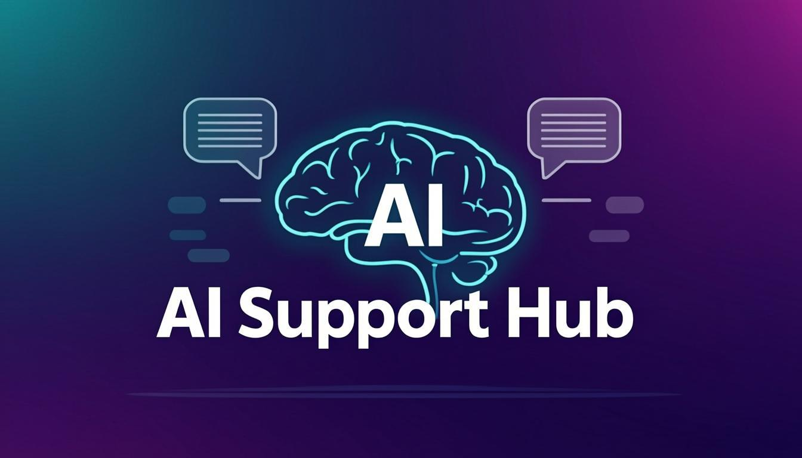

# AI Support Hub

<p align="center">
  
</p>

<p align="center">
  <strong>AI-Powered Omnichannel Customer Support Platform</strong>
</p>

<p align="center">
  
  
  
  
  
  
</p>

---

## Overview

**AI Support Hub** is a production-ready, AI-powered customer support platform that unifies conversations from multiple channels into a single intelligent inbox. It leverages RAG (Retrieval-Augmented Generation) to provide accurate, knowledge-base-grounded AI responses, supports multilingual communication (English, Thai, Lao), and offers seamless human-AI collaboration.

## Key Features

### Omnichannel Messaging
- **Facebook Messenger** integration via webhook
- **WhatsApp Business** integration via Cloud API
- **Website Live Chat** widget with real-time messaging
- Unified inbox for all channels

### AI-Powered Support
- **RAG (Retrieval-Augmented Generation)** - AI responses grounded in your company knowledge base
- **Auto-Reply Mode** - AI automatically responds to customers
- **Suggest Mode** - AI suggests replies for human agents
- **Human-Only Mode** - No AI intervention, agents handle everything
- **Sentiment Analysis** - Real-time customer sentiment detection
- **Language Detection** - Automatic detection of English, Thai, and Lao
- **Conversation Summarization** - AI-generated conversation summaries

### Knowledge Base (RAG)
- Upload documents (PDF, DOCX, TXT) as AI knowledge sources
- Create and manage FAQ entries
- Keyword-based relevance scoring for knowledge retrieval
- Configurable RAG settings (max documents, max FAQs, temperature)

### Real-Time Communication
- Socket.IO powered real-time messaging
- Typing indicators
- Online presence and status tracking
- Read receipts
- Instant message delivery

### Customer CRM
- Customer profiles with contact details
- Lead status tracking (New, Contacted, Qualified, etc.)
- Sentiment tracking per customer
- Tag system for customer categorization
- Notes and activity history

### Team Management
- Role-based access control (Super Admin, Admin, Agent, Viewer)
- Agent status management (Online, Offline, Away, Busy)
- Conversation assignment and routing
- Staff performance overview

### Automation
- Rule-based automation engine
- Triggers: new conversation, keyword match, sentiment change, inactivity
- Configurable conditions and actions
- Auto-assignment and auto-response rules

### Dashboard & Analytics
- Real-time conversation statistics
- AI performance metrics (response time, token usage)
- Channel distribution overview
- Agent workload visualization

---

## Tech Stack

| Category | Technology |
|----------|------------|
| **Framework** | Next.js 16 (App Router) |
| **Language** | TypeScript 5 |
| **Styling** | Tailwind CSS 4 + shadcn/ui |
| **Database** | SQLite via Prisma ORM |
| **Real-Time** | Socket.IO |
| **AI** | z-ai-web-dev-sdk (LLM with RAG) |
| **State Management** | Zustand |
| **Animations** | Framer Motion |
| **Icons** | Lucide React |
| **Charts** | Recharts |

---

## Project Structure

```
src/
├── app/
│   ├── api/                          # API Routes
│   │   ├── ai/                       # AI stats & test endpoints
│   │   ├── auth/                     # Authentication (login, logout, me)
│   │   ├── automation/               # Automation rules CRUD
│   │   ├── channels/                 # Channel management & Facebook/WhatsApp setup
│   │   ├── conversations/            # Conversations, messages, AI reply, assignment
│   │   ├── customers/                # Customer CRUD
│   │   ├── dashboard/                # Dashboard statistics
│   │   ├── faqs/                     # FAQ management
│   │   ├── knowledge/                # Knowledge base (documents + upload)
│   │   ├── notifications/            # Notifications
│   │   ├── send/                     # Send messages (Facebook, WhatsApp)
│   │   ├── settings/                 # App settings
│   │   ├── staff/                    # Staff management
│   │   └── webhooks/                 # Facebook & WhatsApp webhooks
│   └── page.tsx                      # Main app entry (SPA)
├── components/
│   ├── auth/                         # Login page
│   ├── chat/                         # Chat window, message bubbles, input
│   ├── common/                       # Customer detail panel
│   ├── inbox/                        # Conversation list & items
│   ├── layout/                       # App shell with sidebar navigation
│   ├── pages/                        # Page components (Dashboard, Inbox, etc.)
│   └── ui/                           # shadcn/ui components
├── hooks/                            # Custom React hooks
│   ├── use-socket.ts                 # Socket.IO connection hook
│   ├── use-toast.ts                  # Toast notifications
│   └── use-mobile.ts                 # Mobile detection
├── lib/
│   ├── ai.ts                         # AI service (RAG, chat, sentiment, etc.)
│   ├── db.ts                         # Prisma client instance
│   ├── seed.ts                       # Database seeder
│   ├── store.ts                      # Zustand stores (auth, conversations, etc.)
│   └── utils.ts                      # Utility functions
└── prisma/
    └── schema.prisma                 # Database schema (13 models)

mini-services/
└── chat-service/                     # Socket.IO real-time service (port 3003)
```

---

## Database Schema

The platform uses 13 Prisma models:

| Model | Description |
|-------|-------------|
| **User** | Staff accounts with role-based access |
| **Channel** | Communication channels (Facebook, WhatsApp, Website) |
| **Customer** | Customer profiles with CRM data |
| **CustomerTag** | Tags for customer categorization |
| **Conversation** | Support conversations with AI mode settings |
| **Message** | Individual messages with metadata |
| **Assignment** | Agent-to-conversation assignments |
| **AiLog** | AI interaction logs and metrics |
| **Document** | Knowledge base documents |
| **Faq** | FAQ entries for RAG |
| **AutomationRule** | Automation triggers and actions |
| **Notification** | User notifications |
| **Setting** | Application settings (key-value) |

---

## Getting Started

### Prerequisites

- [Node.js](https://nodejs.org/) 18+ or [Bun](https://bun.sh/)
- npm, yarn, or bun package manager

### Installation

```bash
# Clone the repository
git clone https://github.com/Somchit-cmd/AI-Support-Hub.git
cd AI-Support-Hub

# Install dependencies
bun install

# Set up environment variables
cp .env.example .env
# Edit .env with your configuration

# Initialize the database
bun run db:push

# Start the development server
bun run dev
```

### Environment Variables

Create a `.env` file in the project root:

```env
# Database
DATABASE_URL=file:./db/custom.db

# Facebook Messenger (optional)
FACEBOOK_PAGE_ACCESS_TOKEN=your_page_access_token
FACEBOOK_APP_SECRET=your_app_secret
FACEBOOK_VERIFY_TOKEN=your_verify_token

# WhatsApp Business (optional)
WHATSAPP_ACCESS_TOKEN=your_whatsapp_access_token
WHATSAPP_PHONE_NUMBER_ID=your_phone_number_id
WHATSAPP_VERIFY_TOKEN=your_verify_token
```

### Starting the Chat Service

The real-time chat service runs separately on port 3003:

```bash
cd mini-services/chat-service
bun install
bun run dev
```

---

## Channel Setup

### Facebook Messenger

1. Create a Facebook App at [developers.facebook.com](https://developers.facebook.com/)
2. Add Messenger to your app
3. Generate a Page Access Token
4. Configure the webhook URL: `https://your-domain.com/api/webhooks/facebook`
5. Add your credentials in **Settings > Channels**

### WhatsApp Business

1. Set up a WhatsApp Business Account at [Meta Business Suite](https://business.facebook.com/)
2. Create a WhatsApp Business app
3. Get your Phone Number ID and Access Token
4. Configure the webhook URL: `https://your-domain.com/api/webhooks/whatsapp`
5. Add your credentials in **Settings > Channels**

### Website Live Chat

The website live chat works out of the box with the built-in Socket.IO service. No additional configuration needed.

---

## AI & RAG Configuration

### How the AI Works

The platform uses **z-ai-web-dev-sdk** for AI capabilities with RAG (Retrieval-Augmented Generation):

1. When a customer sends a message, the system retrieves relevant knowledge from your documents and FAQs
2. The knowledge context is injected into the AI prompt
3. The AI generates a response grounded in your company's actual data
4. Responses are logged for analytics and improvement

### AI Modes

| Mode | Description |
|------|-------------|
| **Auto** | AI automatically responds to customers without agent intervention |
| **Suggest** | AI suggests replies that agents can accept, modify, or reject |
| **Human** | No AI intervention; agents handle all conversations |

### Knowledge Base Setup

1. Navigate to **Knowledge** in the sidebar
2. Upload documents (PDF, DOCX, TXT) or add URLs
3. Create FAQ entries with questions and answers
4. The AI will automatically use this knowledge when generating responses

### Configurable AI Settings

Available in **Settings > AI**:

- AI Mode (Auto / Suggest / Human)
- AI Personality (Professional, Friendly, Casual)
- Custom System Prompt
- Temperature (0.0 - 1.0)
- Max Tokens
- RAG Enabled / Disabled
- Max Documents per query
- Max FAQs per query

---

## Screenshots

### Dashboard
Real-time overview of conversations, AI performance, and channel distribution.

### Inbox
Unified omnichannel inbox with conversation list, chat window, and customer details panel.

### Knowledge Base
Upload documents and manage FAQs that power the AI's RAG responses.

### Settings
Configure AI behavior, channel connections, and platform branding.

---

## API Endpoints

| Method | Endpoint | Description |
|--------|----------|-------------|
| **Auth** | | |
| POST | `/api/auth/login` | Staff login |
| POST | `/api/auth/logout` | Staff logout |
| GET | `/api/auth/me` | Get current user |
| **Conversations** | | |
| GET | `/api/conversations` | List conversations |
| GET | `/api/conversations/[id]` | Get conversation with messages |
| POST | `/api/conversations/[id]/messages` | Send a message |
| POST | `/api/conversations/[id]/ai-reply` | Generate AI reply |
| POST | `/api/conversations/[id]/assign` | Assign agent |
| **Customers** | | |
| GET | `/api/customers` | List customers |
| GET/PUT/DELETE | `/api/customers/[id]` | Customer CRUD |
| **Knowledge** | | |
| GET/POST | `/api/knowledge` | List/upload documents |
| DELETE | `/api/knowledge/documents/[id]` | Delete document |
| GET/POST | `/api/faqs` | FAQ CRUD |
| **Channels** | | |
| GET/POST | `/api/channels` | List/create channels |
| PUT/DELETE | `/api/channels/[id]` | Update/delete channel |
| **Webhooks** | | |
| GET/POST | `/api/webhooks/facebook` | Facebook Messenger webhook |
| GET/POST | `/api/webhooks/whatsapp` | WhatsApp webhook |
| **AI** | | |
| GET | `/api/ai/stats` | AI usage statistics |
| POST | `/api/ai/test` | Test AI with a message |
| **Other** | | |
| GET | `/api/dashboard` | Dashboard statistics |
| GET/POST | `/api/automation` | Automation rules CRUD |
| GET/POST | `/api/staff` | Staff management |
| GET/PUT | `/api/settings` | App settings |
| GET | `/api/notifications` | User notifications |

---

## Architecture

```
┌──────────────────────────────────────────────────┐
│                   Frontend (Next.js)              │
│         React + Zustand + shadcn/ui              │
└─────────────┬─────────────────┬──────────────────┘
              │                 │
              ▼                 ▼
┌─────────────────────┐ ┌─────────────────────┐
│   Next.js API       │ │  Socket.IO Service   │
│   Routes (REST)     │ │  (Port 3003)         │
│                     │ │  Real-time messaging  │
└─────────┬───────────┘ └──────────┬──────────┘
          │                        │
          ▼                        │
┌─────────────────────┐           │
│   AI Service        │           │
│   (z-ai-web-dev-sdk)│           │
│   + RAG Pipeline    │           │
└─────────┬───────────┘           │
          │                        │
          ▼                        ▼
┌─────────────────────────────────────────────────┐
│              SQLite (Prisma ORM)                 │
│    Conversations, Messages, Knowledge, etc.      │
└─────────────────────────────────────────────────┘
```

---

## Contributing

1. Fork the repository
2. Create your feature branch (`git checkout -b feature/amazing-feature`)
3. Commit your changes (`git commit -m 'Add amazing feature'`)
4. Push to the branch (`git push origin feature/amazing-feature`)
5. Open a Pull Request

---

## License

This project is licensed under the MIT License.

---

<p align="center">
  Built with ❤️ using Next.js, TypeScript, and AI
</p>
